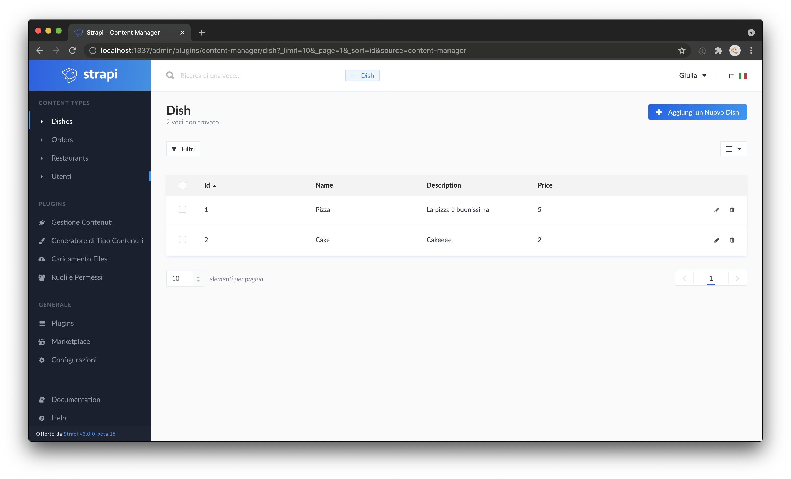

⚠️ Client does not work properly. Server does.

----
# 📒 Strapi Deliveroo tutorial

Basic todo list application.

| \                                                                          | \                                                                              |
|----------------------------------------------------------------------------|--------------------------------------------------------------------------------|
| Deploy status                                                              | /                                                                              |
| Deploy preview                                                             | /                                                                              |
| Project typology                                                           | 📒  Step by step from tutorial [Deliveroo clone with Next.js, GraphQL, Strapi and Stripe - Strapi](https://strapi.io/blog/strapi-next-setup) |



## 🔥 Tech stack

| Purpose       | Technology   |
|:--------------|:-------------|
| Framework     | VueJS        |
| Styling       | SCSS + BEMIT |
| Documentation | Markdown     |
| CMS (headless) | Strapi     |

## 🌊 Run development mode

To run the server, enter into the `server` folder:

```shell
# install dependencies
npm i

# serve with hot reload at localhost:3000
npm run start
```

## 🧳 Build setup

```shell
# build for production
npm run build
```

### 🌿 Branches

| Branch name | Use        |
|:------------|:-----------|
| `main`      | production |
